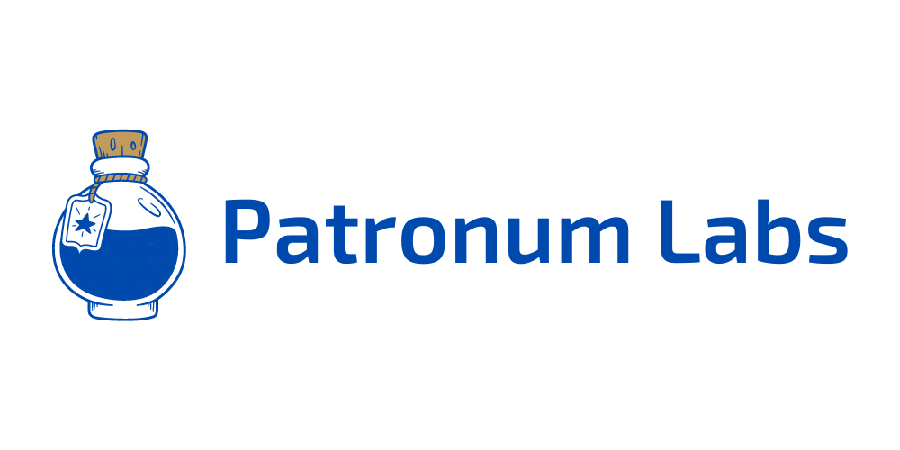

**Patronum Labs** is an open-source organization focused on providing developer-friendly tools and services for the Ethereum ecosystem. This GitHub Organization hosts all of Patronum Labs' open-source projects, tools, and utility libraries.

We are currently building and maintaining:

* [force-transfer](https://github.com/Patronum-Labs/force-transfer): An npm package containing a utility library for forcing native token transfers using `selfdestruct` and a singleton `ForceTransfer` contract.
* [nick-method](https://github.com/Patronum-Labs/nick-method): An npm package with utility functions for generating transactions according to the Nick method, used for legacy transactions pre-EIP155.
* [evm-robot](https://github.com/Patronum-Labs/evm-robot): A development tool to assist developers while developing, debugging, and browsing the blockchain.
* [dune-dashboards](https://github.com/Patronum-Labs/dune-dashboards): Dune Dashboards with analytics for projects and relevant protocols.

We welcome contributions to our projects! Please check individual repositories for contribution guidelines.

